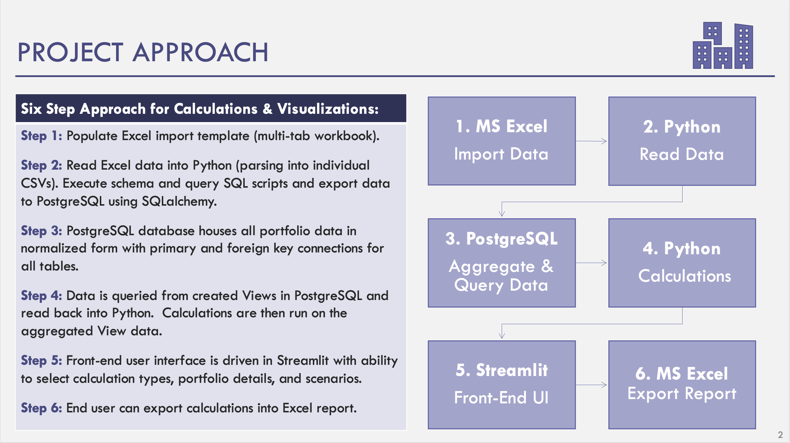
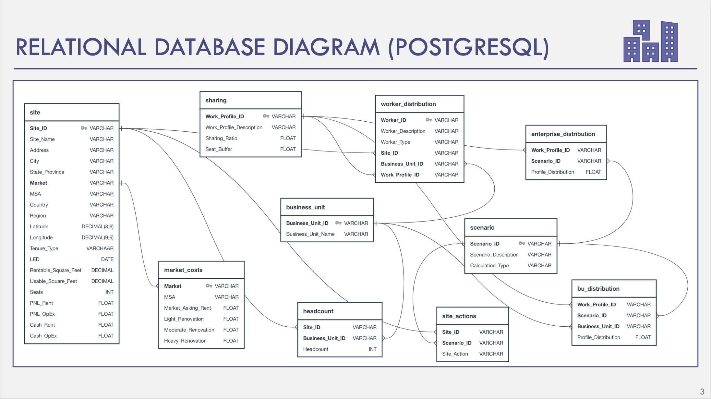
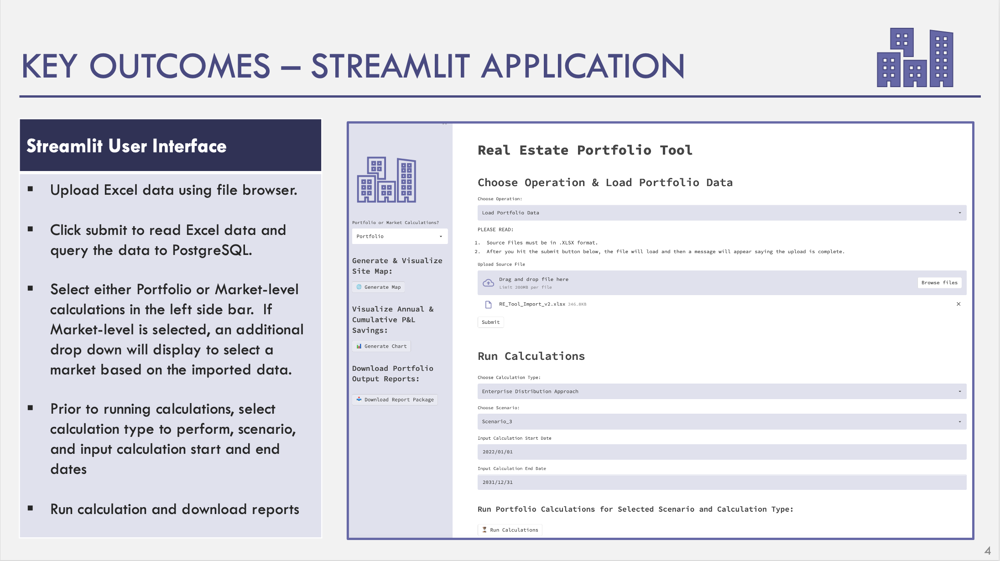
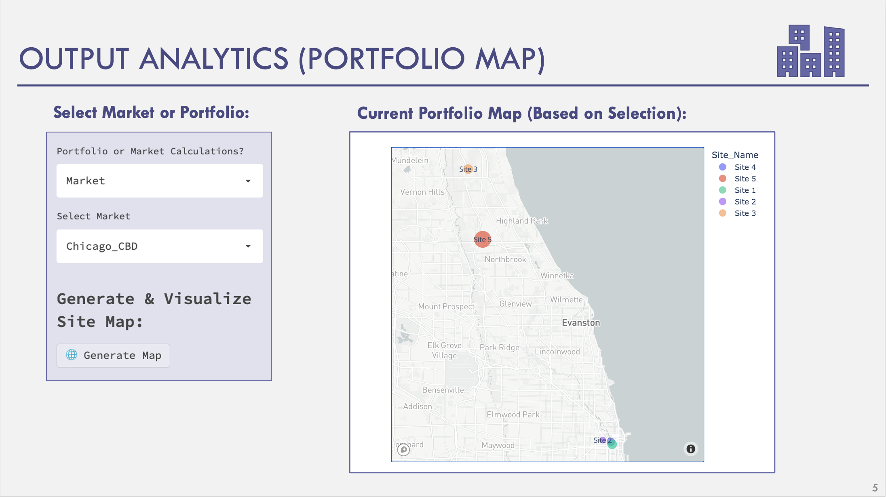
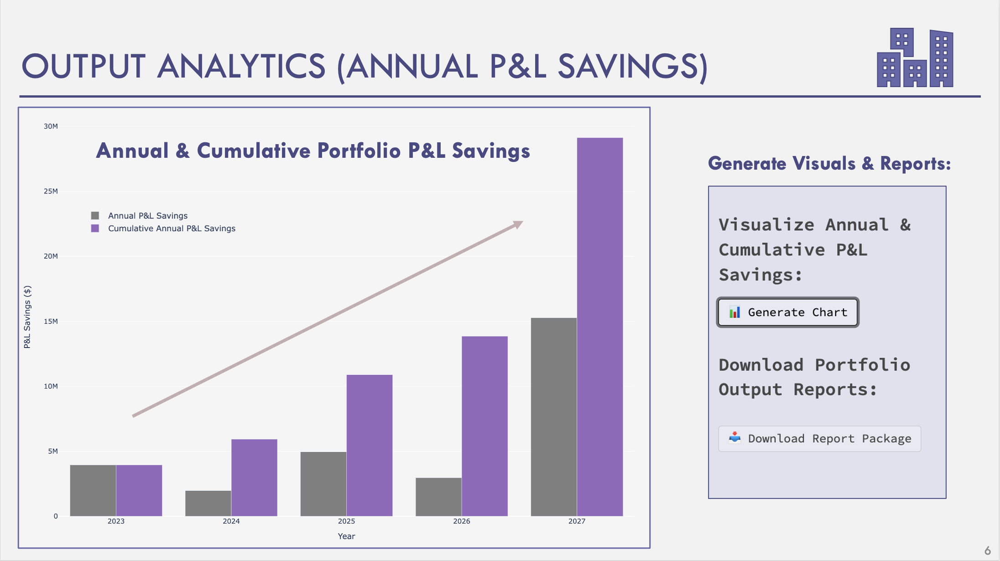
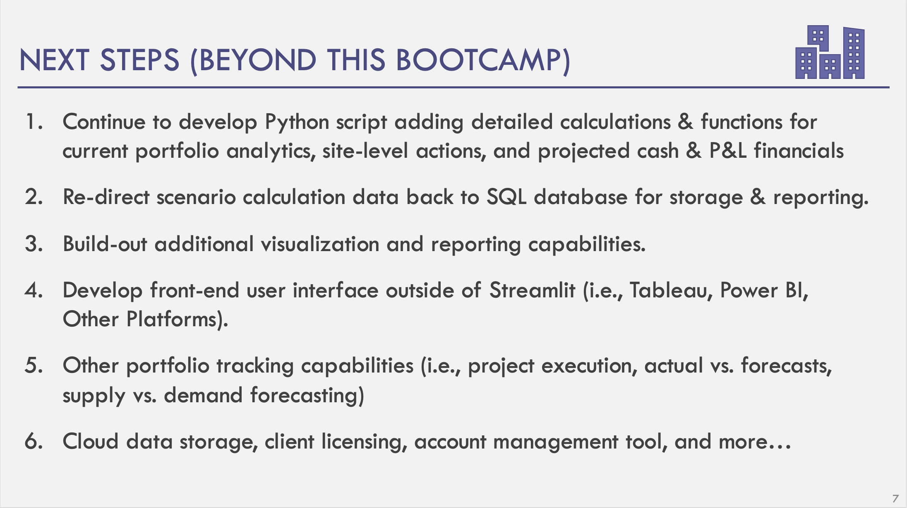

# Real-Estate-Portfolio-Tool

## Prototype Objectives

1. An application prototype (or “minimum viable product”) capable of reading, analyzing & visualizing real estate portfolio data and running portfolio calculations for selected portfolio actions and scenarios. 

2. Create a technology-based real estate forecasting tool with the power to store client real estate data and automate calculations that support client real estate decisions.

3. Build an end-to-end application that imports structured Excel-based data, stores data in a relational SQL database, runs portfolio calculations in Python, and visualizes & reports outputs in Streamlit.

## Why Build this Tool?

1. Corporate entities are now making quicker, high-profile decisions around real estate due to the pandemic and accelerated adoption of Hybrid work.

2. Currently there is a lack of technology to support corporate real estate organizations and professionals in making quick and effective real estate decisions.

3. Organization are slow in speed to execute strategies due to data silos and inaccuracies and there is a lack of technology that supports automation.

## Prototype Approach & Outcomes

